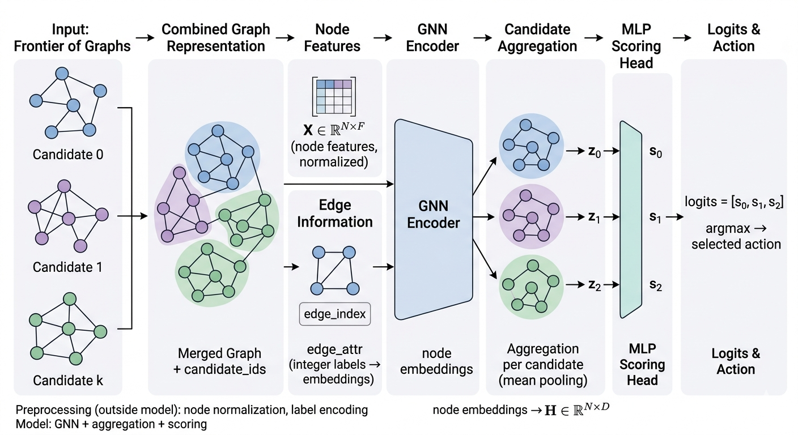

# Offline RL for Frontier Policy over Graphs



`rl_handler` is an offline reinforcement learning pipeline that learns to pick the best
successor graph from a frontier (a set of candidates produced from the same predecessor).

```text
CSV + DOT -> Frontier Samples -> GNN Policy -> Candidate Logits -> argmax Action
```

The training objective is to maximize expected reward over each frontier:

```math
p_i = \operatorname{softmax}(s_i)
```

```math
\mathcal{L} = - \mathbb{E}_{\text{frontier}} \left[\sum_i p_i \, r_i\right]
```

## What this module provides

- Frontier dataset building from raw CSV/DOT data
- GNN-based policy training (`gine`, `rgcn`, `gcn`)
- Evaluation on random and stress frontier splits
- ONNX export for C++ inference
- Optional PyTorch-vs-ONNX parity and frontier order/removal checks

## Data and preprocessing

The dataset builder:

1. Reads CSV rows with `File Path`, `Depth`, `Distance From Goal`,
   `File Path Predecessor`, and `Goal` (required in `separated` mode).
2. Groups candidates by predecessor to form frontiers.
3. Drops invalid frontiers:
   - singleton frontiers
   - all-failure frontiers
   - ambiguous goal mappings in `separated` mode
4. Loads each DOT graph into PyTorch Geometric tensors:
   - `node_features`
   - `edge_index`
   - `edge_attr`

Node encoding depends on `--dataset_type`:

- `HASHED`: scalar node IDs (raw or already normalized). In-model normalization is applied if needed.
- `MAPPED`: scalar mapped IDs.
- `BITMASK`: binary node vectors.

`edge_attr` must always be integer edge-label IDs consistent with training.

## Graph composition modes

Graph composition must be identical in training and deployment.

Let a frontier have $K$ candidates. For candidate $k \in \{0, \ldots, K-1\}$, define:

- $X_k \in \mathbb{R}^{N_k \times F}$: node features
- $E_k \in \mathbb{N}^{2 \times M_k}$: edge indices
- $A_k \in \mathbb{N}^{M_k \times 1}$: edge attributes

Mask is always built from the number of valid candidates in the current frontier:

```math
\text{mask}[k] =
\begin{cases}
\text{True}, & k < n_{\text{candidates}} \\
\text{False}, & k \ge n_{\text{candidates}}
\end{cases}
```

### `merged`

Concept: candidates stay disconnected and are concatenated block-by-block
(same composition style as `separated`).

Difference from `separated`: no goal branch is passed to model forward in
`merged`, because goal information is already encoded in successor states.

### `separated`

Concept: candidates stay disconnected and are concatenated block-by-block.

How tensors are built:

1. Concatenate node features:

   ```math
   \text{node\_features} =
   \begin{bmatrix}
   X_0 \\
   X_1 \\
   \vdots \\
   X_{K-1}
   \end{bmatrix}
   ```

2. Compute node offsets:

   ```math
   o_k = \sum_{j<k} N_j
   ```

3. Shift each edge index and concatenate:

   ```math
   \text{edge\_index} = [E_0 + o_0,\ E_1 + o_1,\ \ldots,\ E_{K-1} + o_{K-1}]
   ```

4. Concatenate edge attributes:

   ```math
   \text{edge\_attr} =
   \begin{bmatrix}
   A_0 \\
   A_1 \\
   \vdots \\
   A_{K-1}
   \end{bmatrix}
   ```

5. Build membership by repeating each candidate id for its nodes:

   ```math
   \text{membership} =
   [\,\underbrace{0,\ldots,0}_{N_0},\ \underbrace{1,\ldots,1}_{N_1},\ \ldots,\ \underbrace{K-1,\ldots,K-1}_{N_{K-1}}\,]
   ```

6. Goal is passed as a separate graph branch:
   - `goal_node_features = X_g`
   - `goal_edge_index = E_g`
   - `goal_edge_attr = A_g`
   - `goal_batch = 0` for every goal node in single-frontier inference

If multiple goals are batched together, `goal_batch` contains the goal graph id per node.

### `merged` vs `separated`

| Feature                        | `merged`                | `separated`                |
|--------------------------------|-------------------------|----------------------------|
| Candidate graph topology       | disconnected concatenation | disconnected concatenation |
| Node sharing across candidates | no                         | no                         |
| Goal handling                  | inside successor graphs    | separate goal input branch |
| Additional ONNX goal inputs    | no                      | yes                        |

## Model input contract (PyTorch / ONNX)

Core tensors:

| Tensor          | Shape    | DType     | Meaning                       |
|-----------------|----------|-----------|-------------------------------|
| `node_features` | `[N, F]` | `float32` | Node feature matrix           |
| `edge_index`    | `[2, E]` | `int64`   | Edge list (`src`, `dst`)      |
| `edge_attr`     | `[E, 1]` | `int64`   | Edge label ID per edge        |
| `membership`    | `[N]`    | `int64`   | Candidate index for each node |
| `mask`          | `[K]`    | `bool`    | Valid candidate slots         |

Additional tensors in `separated` mode:

| Tensor               | Shape     | DType     | Meaning                     |
|----------------------|-----------|-----------|-----------------------------|
| `goal_node_features` | `[GN, F]` | `float32` | Goal graph node features    |
| `goal_edge_index`    | `[2, GE]` | `int64`   | Goal graph edges            |
| `goal_edge_attr`     | `[GE, 1]` | `int64`   | Goal graph edge labels      |
| `goal_batch`         | `[GN]`    | `int64`   | Goal graph batch assignment |

Output:

- Logits shape: $[K]$
- Action selection:

```math
a = \arg\max_{k < n_{\text{candidates}}} \, \text{logits}_k
```

Plain-text equivalent:

```text
action = argmax(logits[:n_candidates])
```

## What the model returns (logits and context semantics)

- Forward output is one scalar logit per candidate.
- A larger logit means stronger model preference before normalization.
- Selection is `argmax(logits)` over valid candidates.
- With `--use-global-context true`, each candidate score depends on all candidates in that frontier.
- With `--use-global-context false`, explicit frontier-level context concatenation is disabled.

## ONNX usage (merged vs separated)

Export examples:

```bash
# merged
python3 lib/rl_handler/__main__.py --kind-of-data merged --export-onnx true

# separated
python3 lib/rl_handler/__main__.py --kind-of-data separated --export-onnx true
```

Minimal inference input examples:

```python
from src.graph_utils import load_pyg_graph, combine_graphs
import numpy as np

g1 = load_pyg_graph("s1.dot", dataset_type="HASHED")
g2 = load_pyg_graph("s2.dot", dataset_type="HASHED")
g3 = load_pyg_graph("s3.dot", dataset_type="HASHED")
n_candidates = 3
mask = np.array([True, True, True], dtype=bool)

# merged: goal already inside successor graphs
merged = combine_graphs(
    frontier_graphs=[g1, g2, g3],
    goal_graph=None,
    kind_of_data="merged",
    action_ids=[0, 1, 2],
)
onnx_inputs_merged = {
    "node_features": merged.node_features.numpy().astype("float32"),
    "edge_index": merged.edge_index.numpy().astype("int64"),
    "edge_attr": merged.edge_attr.numpy().astype("int64"),
    "membership": merged.membership.numpy().astype("int64"),
    "mask": mask,
}

# separated: goal passed as separate branch
goal = load_pyg_graph("goal.dot", dataset_type="HASHED")
separated = combine_graphs(
    frontier_graphs=[g1, g2, g3],
    goal_graph=goal,
    kind_of_data="separated",
    action_ids=[0, 1, 2],
)
onnx_inputs_separated = {
    "node_features": separated.node_features.numpy().astype("float32"),
    "edge_index": separated.edge_index.numpy().astype("int64"),
    "edge_attr": separated.edge_attr.numpy().astype("int64"),
    "membership": separated.membership.numpy().astype("int64"),
    "goal_node_features": goal.node_features.numpy().astype("float32"),
    "goal_edge_index": goal.edge_index.numpy().astype("int64"),
    "goal_edge_attr": goal.edge_attr.numpy().astype("int64"),
    "goal_batch": np.zeros((goal.node_features.size(0),), dtype="int64"),
    "mask": mask,
}
```

## Quick start

From the repository root:

```bash
python3 -m venv .venv
source .venv/bin/activate
pip install -r lib/rl_handler/requirements.txt
python3 lib/rl_handler/__main__.py --help
```

Example: merged mode training + eval + ONNX export

```bash
python3 lib/rl_handler/__main__.py \
  --folder-raw-data <path/to/training_data> \
  --subset-train <dataset_a> <dataset_b> \
  --dir-save-data <path/to/output_data> \
  --dir-save-model <path/to/output_models> \
  --kind-of-data merged \
  --dataset_type HASHED
```

Example: separated mode (goal as separate input branch)

```bash
python3 lib/rl_handler/__main__.py \
  --folder-raw-data <path/to/training_data> \
  --subset-train <dataset_a> <dataset_b> \
  --dir-save-data <path/to/output_data> \
  --dir-save-model <path/to/output_models> \
  --kind-of-data separated
```

## Generated artifacts

Main outputs (inside `--dir-save-data` / `--dir-save-model`, optionally under `--experiment-name`):

- `processed_data/train_samples.pt`
- `processed_data/samples_params.pt`
- `processed_data/query_bundle.json` (train/test x random/fifo/stress queries)
- `best.pt`
- `metrics/<model_name>.pt`
- `<model_name>.onnx`
- `metrics/eval_reports/*.json` (per-eval-step summaries)
- `metrics/eval_onnx/**/final_metrics.json` (ONNX evaluation by split)
- `metrics/onnx/*.json` (example parity checks)

## Deployment checklist

- Keep graph composition identical to training mode (`merged` or `separated`).
- Keep edge-label integer mapping identical to training.
- Ensure `edge_index` references valid node rows in `node_features`.
- Ensure `membership` correctly groups nodes by candidate.
- Ensure `mask` enables only valid candidate slots.

## CLI reference (`__main__.py::parse_args`)

### Paths and naming

| Parameter           | Default           | Effect                                                  |
|---------------------|-------------------|---------------------------------------------------------|
| `--subset-train`    | `[]`              | Restrict training to specific dataset subfolders.       |
| `--folder-raw-data` | `out/NN/Training` | Root containing raw CSV/DOT training data.              |
| `--dir-save-data`   | `data`            | Output root for materialized `.pt` samples.             |
| `--dir-save-model`  | `models`          | Output root for checkpoints, metrics, ONNX.             |
| `--experiment-name` | `""`              | Optional subdirectory under save roots (run isolation). |
| `--model-name`      | `frontier_policy` | Base filename for model/ONNX/report artifacts.          |

### Data semantics and dataset build

| Parameter                           | Default             | Effect                                                                    |
|-------------------------------------|---------------------|---------------------------------------------------------------------------|
| `--dataset_type`                    | `HASHED`            | Node encoding mode: `HASHED`, `MAPPED`, `BITMASK`.                        |
| `--kind-of-data`                    | `merged`            | Frontier composition mode: `merged` or `separated`.                       |
| `--n-max-dataset-queries`           | `1000`              | Max random/stress eval queries generated per dataset.                     |
| `--max-size-frontier`               | `25`                | Max frontier size in stress FIFO/LIFO scheduling.                         |
| `--max-failure-states-per-dataset`  | `0.3`               | Caps train frontiers with failures (ratio to no-failure train frontiers). |
| `--reward-formulation`              | `negative_distance` | Reward mode label (pipeline uses distance-derived rewards).               |
| `--max-regular-distance-for-reward` | `50.0`              | Distance threshold used for reward scaling and failure cut.               |
| `--failure-reward-value`            | `-1.0`              | Reward assigned to failure states (`distance > max_regular_distance`).    |
| `--build-data`                      | `true`              | Rebuild materialized train samples from raw data.                         |
| `--build-eval-data`                 | `true`              | Rebuild query bundle for ONNX eval (`train/test × random/fifo/stress`).   |

### Training and optimization

| Parameter                         | Default | Effect                                                                         |
|-----------------------------------|---------|--------------------------------------------------------------------------------|
| `--batch-size`                    | `9092`  | Dataloader batch size (number of frontiers per step).                          |
| `--n-train-epochs`                | `200`   | Number of training epochs.                                                     |
| `--eval-every`                    | `20`    | Evaluate every N epochs during training.                                       |
| `--num-workers`                   | `0`     | DataLoader worker processes.                                                   |
| `--seed`                          | `42`    | RNG seed for split/build/sampling reproducibility.                             |
| `--lr`                            | `1e-3`  | AdamW learning rate.                                                           |
| `--weight-decay`                  | `0.0`   | AdamW weight decay.                                                            |
| `--max-grad-norm`                 | `0.0`   | Gradient clipping threshold (`>0` enables clipping).                           |
| `--early-stopping-patience-evals` | `0`     | Early stop after N eval checkpoints without reward improvement (`0` disables). |

### Model architecture

| Parameter                   | Default | Effect                                                                     |
|-----------------------------|---------|----------------------------------------------------------------------------|
| `--gnn-layers`              | `3`     | Number of message-passing layers in encoder.                               |
| `--hidden-dim`              | `128`   | Hidden size for encoder/head.                                              |
| `--conv-type`               | `gine`  | GNN layer family: `gine`, `rgcn`, `gcn`.                                   |
| `--pooling-type`            | `mean`  | Node-to-candidate pooling: `mean`, `sum`, `max`.                           |
| `--edge-emb-dim`            | `32`    | Edge-label embedding size.                                                 |
| `--num-node-labels`         | `4096`  | Size of node label embedding table.                                        |
| `--use-global-context`      | `true`  | Concatenate frontier context (mean candidate embedding) in policy head.    |
| `--mlp-depth`               | `2`     | Depth of policy MLP head.                                                  |

### Execution, evaluation, ONNX

| Parameter                    | Default | Effect                                                               |
|------------------------------|---------|----------------------------------------------------------------------|
| `--train`                    | `true`  | Run training loop.                                                   |
| `--evaluate`                 | `true`  | Run ONNX evaluation on query splits during training and after train. |
| `--export-onnx`              | `true`  | Export ONNX model after train/load.                                  |
